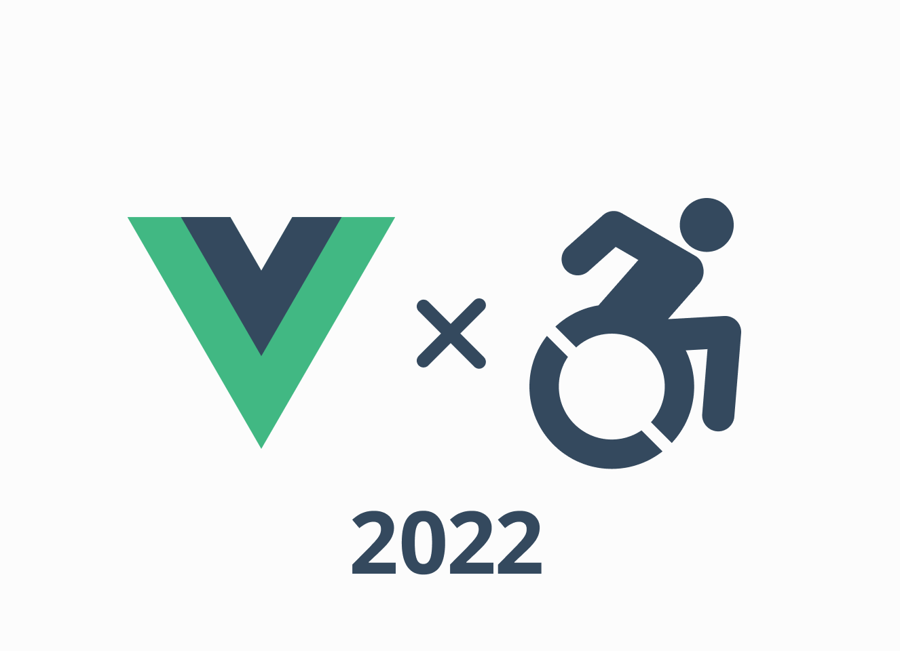
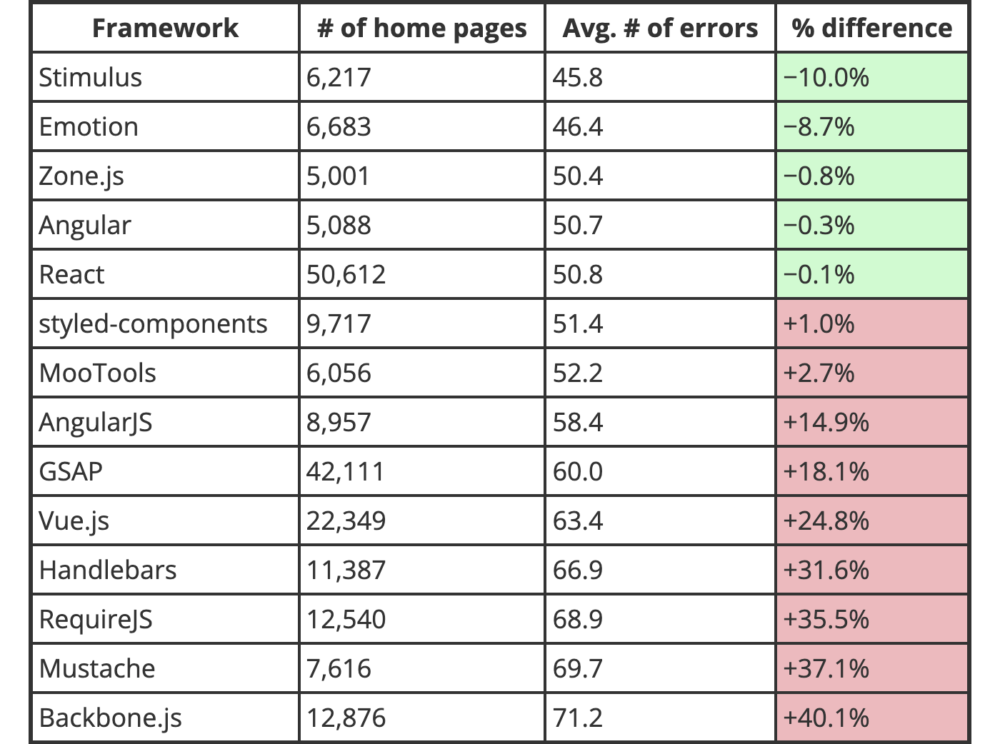
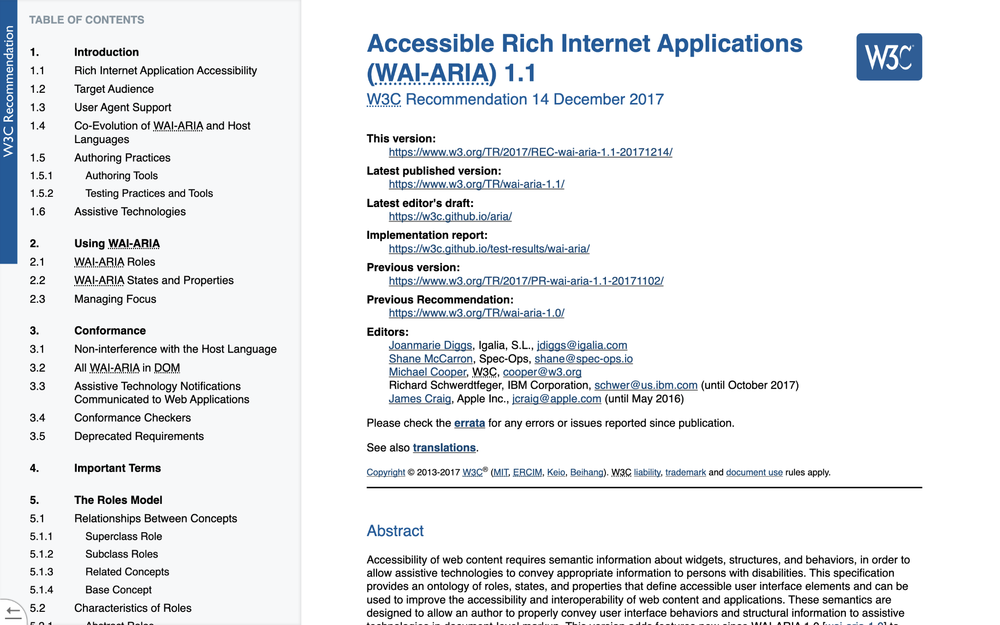
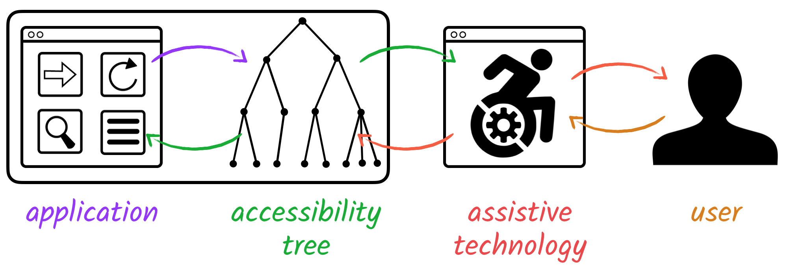
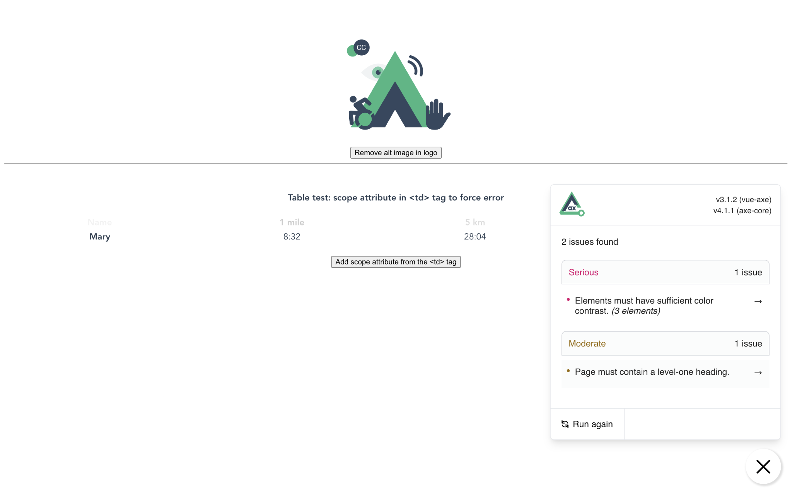

## 翻訳記事一覧

[日本語ページ](https://yamanoku.net/vuefes-japan-online-2022/ja/) / [English page](https://yamanoku.net/vuefes-japan-online-2022/en/)

## はじめに

最初に自己紹介です。


[やまのく](https://twitter.com/yamanoku)と申します。Web デザイナーとして働き出して、マークアップエンジニアとして本格的に Web 技術に触れはじめ、アクセシビリティの分野に関心を高めていきました。

現在は事業会社に所属し、Web 標準の技術を活用してユーザー体験を向上させていきたいと考えている者です。

今回の Vue Fes Japan Online 2022 では Vue.js とアクセシビリティにまつわるテーマで発表させていただくのですが、はじめに、なぜこのテーマで発表するのかを説明します。

それは Vue.js での開発においてアクセシビリティを考慮する機会が少ないのではないかと思ったからです。

アクセシビリティについて簡単に説明すると、誰もが情報へアクセスできるようにする考え方で、Web においてその考え方を実践するのが Web アクセシビリティというものです。

最近のフロントエンド開発において、ここに注力できることはサイトやプロダクトの価値付け、他との差別化ができる領域になってきています。

Vue3 のドキュメントから[アクセシビリティに関する項目](https://ja.vuejs.org/guide/best-practices/accessibility.html)が追加されました。アクセシビリティの基礎や、実際のユースケースの一部を学べるコンテンツになっています。

Vue2 以前では[草案という形でマージされることなく終わってしまった](https://github.com/vuejs/v2.vuejs.org/pull/1002)のでこうしたドキュメントが追加されたことは良いことです。

ですが、米国の非営利団体 [WebAIM](https://webaim.org/) の調査によると Vue.js を用いたサイトではアクセシビリティ対応が足りていないという報告があがっています。



これは特定のライブラリやフレームワークを使うことがアクセシブルとならない事ではありませんが、一昨年・去年から対応が平均以下となっている事実[^1]があります。

調査されたサイトに日本のものがいくつ含まれているかは定かではありませんが Vue.js で開発をする身として、この状況が野放しになっていいとは思っていません。

このセッションでは３つのテーマに沿って、今後の Vue.js での開発でアクセシビリティに取り組みやすくなる内容を発表いたします。

対象は「Web アクセシビリティを学びはじめた人」や「Vue.js でアクセシビリティの向上をしていきたい人」向けになります。

なお今回の事例で紹介するコードは Vue3 をベースにしたものとなっております。その点、ご了承ください。

## 誤ったアクセシビリティ対応について

アクセシビリティ対応では、あまり理解せずによかれと思ってやったものが何も影響がなかったり、それどころか悪くなることがあります。

悪いアクセシビリティ対応をなくすためにもよく間違いやすい対応について先に学んでいきましょう。



アクセシビリティを意識するようになってから WAI-ARIA について知った人は多いでしょう。

WAI-ARIA はスクリーンリーダーといった支援技術へ HTML だけでは表現しきれないアクセシブルな情報を補完する技術仕様です。



ブラウザから DOM ツリーと CSS のレンダリングを解析してアクセシビリティに関する情報がアクセシビリティツリーに反映されます。

そして OS ごとのアクセシビリティ API から支援技術もってユーザーに情報が届きます。

WAI-ARIA はこのアクセシビリティツリーの中で認知できるように意味づけしてあげるという形です。

WAI-ARIA を使うことでアクセシビリティを高めることができると使い出す人がいます。私もその１人でした。

ですが WAI-ARIA を使用するに辺り気をつけなければならないことがあります。

それは「**NO ARIA is better than BAD ARIA（ARIA 無しのほうが、悪い ARIA よりも良い）**」ということです[^2]。

つまり、WAI-ARIA を間違って使うくらいならそれを使わないほうがまだアクセシビリティとしてマシであるということです。

今回はそんな WAI-ARIA の使用について、開発時に誤りやすいものや意識し忘れがちな部分について紹介します。

### aria-label

まずは aria-label。こちらは支援技術に伝えたいテキスト情報がある場合に使用されるものです。

具体例としてはアイコンだけのボタンが挙げられます。

このパターンではボタン内にテキストがないため「メニュー、ボタン 」として認識されます。

```html
<button type="button" aria-label="メニュー">
  <span class="fa-solid fa-bars"></span>
</button>
```

ではこのパターンではどうなるでしょうか。

```html
<a href="https://ja.vuejs.org/" aria-label="Vue">
  
</a>
```

リンクの内部に画像テキストがある場合ですがこれは `alt` の情報を上書きして「リンク、イメージ、Vue」と読まれてしまいます。

また、この場合は `label` 要素を無効化して「入力フォーム、テキストを編集」と読まれてしまいます。

```html
<label for="text-field">名前</label>
<input type="text" aria-label="入力フォーム" id="text-field">
```

このように aria-label は本来伝えたかったテキスト情報を上書きしてしまうことがあります。

支援技術のユーザーだけ違う情報を与えてしまうのではなくあらゆる人に同等の情報を与えるために、できる限り見えるテキストで提供してください。

ちなみに aria-label は WAI-ARIA 1.2 より `div` 要素や `span` 要素といった `generic role` など、名前をつけてはならない `role` が定義されています。詳細は[仕様](https://www.w3.org/TR/wai-aria-1.2/#namefromprohibited)をチェックしてみてください。

### aria-hidden

次は aria-hidden について。

次は aria-hidden について。aria-hidden はその要素とすべての子要素をアクセシビリティツリーから削除するものです。

具体例としては支援技術に伝えなくて良い装飾的な要素や重複しているコンテンツ、モーダルが表示されたときにそれ以外のコンテンツを隠すときなどが挙げられます。

```html
<main class="content" aria-hidden="true">
  コンテンツ自体は隠す
</main>
<div
  id="dialog"
  class="dialog-container"
  aria-labelledby="dialog-title"
  aria-describedby="dialog-description"
  aria-modal="true"
  role="dialog">
  <div>
    <h1 id="dialog-title">タイトル</h1>
    <p id="dialog-description">説明</p>
  </div>
</div>
```

aria-hidden はとても強力なものなので使う場合は影響範囲をきちんと把握した上で使いましょう。

たとえばモーダルをラップする親要素に aria-hidden を使ってしまうとモーダルを含めてすべて隠されてしまうからです。

せっかくの支援技術サポートが無駄になってしまいます。

```html
<div aria-hidden="true"><!-- 親が aria-hidden で隠れている -->
  <main class="content">
    コンテンツは隠れる
  </main>
  <div
    id="dialog"
    class="dialog-container"
    aria-modal="true"
    role="dialog">
    モーダル自体も隠れてしまう
  </div>
</div>
```

また、フォーカスさせる要素やそれを内包する要素に使用しないように気をつけてください。

フォーカス自体はできてもその要素が何なのか認識できなくなるからです。

```html
<a href="https://vuefes.jp/2022/" aria-hidden="true">
  Vue Fes Japan Online 2022
</a>
```

一時的に隠すのではなく完全に要素を消したい場合CSS での `display: none` や `hidden` 属性を使うことも検討してみてください。

### aria-live

次は aria-live について。

これはライブリージョンと呼ばれるものでページ内で動的な変化があった場合、それを支援技術へ伝える場合に使用されます。

具体例としては、フォーム入力に変化があった際や SPA における画面遷移時、警告の通知やカルーセルの変化時などが挙げられます。

```html
<script setup lang="ts">
import { ref, computed } from 'vue'
const count = ref<number>(0);
const personNumber = computed(() => {
  if (count.value < 0) return count.value = 0;
  return count.value;
});
</script>

<template>
  <button type="button" @click="count++">増やす</button>
  <button type="button" @click="count--">減らす</button>
  <div role="status" aria-live="polite">
    ﹛{ personNumber }}名
  </div>
</template>
```

通常の通知であれば動作が完了してから読み上げてくれる `aria-live=“polite"` で設定しておくと良いでしょう。

`aria-live="assertive"` は動的な変更がある際に他の操作を割り込んで通知してきます。

これはアラートとしての役割であればよいのですが、自動的に切り替わるカルーセルやフォーム入力中に常に情報を通知してきたら著しくユーザ体験を損ねてしまうので、誤った値で使用しないでください。

### aria-current

最後に aria-current について。

こちらは現在の位置を伝える場合に使用されます。

使用例としてはページネーションやナビゲーション、パンくずのリンクにおいて現在の項目を伝えるときに使用されます。

単体の WAI-ARIA としてはこれまで説明したものと比較すると頻繁に使う機会は少ないでしょう。

ですが、Vue.js で開発する人であればよく見かけるライブラリで使用されています。

それは [Vue Router](https://router.vuejs.org/) です。

`<router-link>` で使用されることもあれば Nuxt.js の標準リンクコンポーネントである `<nuxt-link>` でも使用されています。

```html
<!-- /about にアクセスすると aria-current="page" が付与された a 要素で描画される-->
<router-link to="/about">事例紹介</router-link>
<!-- Nuxt.js の場合 -->
<nuxt-link to="/about">事例紹介</nuxt-link>
```

現在の URL パスと合致するリンク先が設定されている場合そのリンクには `aria-current="page"` が付与されます。

リンクテキスト自体がそのページタイトルと合致していれば有用な使い方と言えます。

ですがこの要素を無作為に置いてしまっていると何が現在位置のものであるかの情報が煩雑になってしまいます。

```html
<div>
  <a href="/about" aria-current="page">事例紹介</a>
  <!-- ... -->
  <!-- ... -->
  <!-- ... -->
  <a href="/about" aria-current="page">事例紹介</a>
  <!-- ... -->
  <!-- ... -->
  <a href="/about" aria-current="page">事例紹介</a>
</div>
```

マークアップする際にはリンクをどういったグルーピングにするか置く領域を意識しましょう。

ちなみに Vue Router には aria-current 部分を API として制御できます[^3]。

値は複数存在しており、ステップや日付、現在時刻の情報を示すことが可能です。aria-current の値が意図したものとなっているか確認してみましょう。

---

このように WAI-ARIA は要素によってはそのまま使用できないものがあったり知らずに使うことでアプリケーションに影響を与えうるものがあります。

使用方法を誤ることで簡単にアクセシブルではないものを作り上げてしまいます。

一方で HTML を使うことはブラウザ標準において同一の挙動がおおよそ保証されています。

WAI-ARIA をよくわからず使ってしまいそうな時は一旦立ち止まってそれらを使わずに HTML だけで表現できないかということも検討してみてください。

開発者向けの Web 技術の情報が集約されている [MDN Web Docs](https://developer.mozilla.org/ja/) には HTML 要素のページでアクセシビリティ上の懸念点が載っています。

普段書いている HTML の使い方が間違ってないかを理解する上で有益なサイトです。

また、HTML をより詳細に学ぶのであれば「[HTML 解体新書](https://www.borndigital.co.jp/book/25999.html)」もオススメします。

現時点でもっとも HTML の仕様書に密接な日本語の書籍ですので実装やレビュー時のリファレンスとしても活用してみてください。

---

## 汎用性のあるアクセシブルなコンポーネントを作る

先程の事例より WAI-ARIA は慎重に使う必要があることを説明いたしました。

ですがそれらをいちいち確認しながらの開発は大変です。

そこでコンポーネント設計でルールを内包させることでチーム開発において認識の齟齬を減らした開発がしやすくなります。

次は汎用性のあるアクセシブルなコンポーネント作りに関するヒントを紹介します。

### TypeScript で補強する

Vue3 からは TypeScript 対応が改善されてきました。これを期に導入しだした人もいるでしょう。

もし導入している場合、アクセシブルなコンポーネント作りを補強するために有用な手段となります。

```html
<script setup lang="ts">
import { computed, defineProps } from 'vue';

type Props = {
  // 見出し要素のレベルをユニオン型で型注釈する
  headlineLevel: 1 | 2 | 3 | 4 | 5 | 6;
  headlineText: string;
}
const props = defineProps<Props>();

// props の見出しレベルを使用して h1 のように表現する
const headlineTag = computed(() => `h${props.headlineLevel}`);
const headingText = computed(() => props.headlineText);
</script>

<template>
  <component :is="headlineTag">
    ﹛{ headingText }}
  </component>
</template>
```

このパターンでは見出しコンポーネントを汎用的に使えるよう実装しました。

`<component>` 要素には `is` 属性によってあらゆる要素を入れられるためそれらを `props` の値から制御する形にしています。

これ以外にも画像コンポーネントのような場合は代替テキストとなる `props` を設置したり多言語対応の際は `lang` 属性にあたるものを `props` に設置するなど、はじめてコンポーネントを使う人にも必要だと分かる `props` を定義しておくとよいでしょう。

```html
<script setup lang="ts">
import { defineProps } from 'vue';

type Props = {
  altText: string;
  lang: 'ja' | 'en' | 'fr';
}

defineProps<Props>();
</script>
```

また [vue-tsc](https://github.com/johnsoncodehk/volar/tree/10d1a6a8b4011adee0a7c309da25caae7fb4fea9/vue-language-tools/vue-tsc) といった型検査ツールを使用すると `<template>` 内の属性値もチェックしてくれます。

```html
<!-- aria-current は空文字が使用できないと怒ってくれる -->
<a :href="url" :aria-current="isCurrentPage: ? 'page' : ''">
  リンク
</a>
```

ここで間違った値が入っていないかも注視してみてください。

### Visually Hidden

Visually Hidden とは視覚的には確認できないが支援技術により確認できる方法です。

[Bootstrap](https://getbootstrap.jp/docs/5.0/helpers/visually-hidden/) といった各種 UI フレームワークで定義されていたりします。

前述した aria-label とも似ていますがこのようなコンポーネントとすることで汎用的に使い回せます。

```html
<script setup lang="ts">
import { computed, defineProps } from 'vue';

type Props = {
  isFocusable?: boolean;
  tag?: 'div' | 'span';
};

const props = defineProps<Props>();
const focusedClass = computed(() => props.isFocusable ? 'visually-hidden-focusable' : 'visually-hidden');
const tag = computed(() => props.tag ? props.tag : 'span');
</script>

<template>
  <component :is="tag" :class="focusedClass">
    <slot />
  </component>
</template>
```

テキストがない場合の Button コンポーネントや、フォームパーツのラベル部分を隠す場合などに活用することができます。

また、CSS の制御よってフォーカスする場合は表示させることができます。

```html
<style scoped>
.visually-hidden,
.visually-hidden-focusable:not(:focus):not(:focus-within) {
  position: fixed;
  top: 0px;
  left: 0px;
  width: 4px;
  height: 4px;
  opacity: 0;
  overflow: hidden;
  border: none;
  margin: 0;
  padding: 0;
  display: block;
  visibility: visible;
}
</style>
```

これは「スキップリンク」という、コンテンツにスキップ移動できる支援技術ユーザーのための手段として使用できます。


通常、画面上には現れませんがヘッダーの内容が多い場合にコンテンツに直接スキップできるようにするものです。

### Fragments

Vue3 からは [Fragments](https://v3-migration.vuejs.org/new/fragments.html) という概念が導入されています。

Vue2 までは `<template>` 内のルート要素は単一のものでなければなりませんでした。
それによりコンポーネントによってはマークアップが間違っている場合がありました。

```html
<template>
  <!-- table-columns のようなコンポーネントを想定 -->
  <!-- Vue2 までは div などをルートにしないといけなかたった -->
  <!-- ただし以下のマークアップは不適応 -->
  <div>
    <tr><td>項目</td></tr>
    <tr><td>内容</td></tr>
  </div>
</template>
```

Fragments によりルートが単一でなくてもよくなりコンポーネントにおけるマークアップの正しさが保証されやすくなりました。

```html
<template>
  <!-- Vue3 からは以下のように書けるようになった -->
  <tr><td>項目</td></tr>
  <tr><td>内容</td></tr>
</template>
```

ただしコンポーネントのルート要素に親コンポーネントからの属性を自動的に付与されなくなることには注意です。

```html
<SubmitButton disabled />
```

```html
<template inheritAttrs="false">
  <!-- root にある div 要素自体に属性は継承されず、 -->
  <div>
    <!-- 指定した button 要素に属性が継承されるようになる -->
    <button type="submit" v-bind="$attrs">
      送信する
    </button>
  </div>
</template>
```

その場合は `inheritAttrs` を `false` にして属性を受け取る要素に `v-bind="$attrs"` を付与しておきましょう。

## アクセシビリティテスト・チェック

アクセシブルなコンポーネントが作れたでしょうか。とても素晴らしいですね。

ですが、コンポーネントを作ること以上に大切なことがあります。それはきちんと動作しているかを確認することです。

というわけで、作ったコンポーネントが本当に問題ないかを確認するためにテストやチェックをしていきましょう。

### Linter

まずは、静的解析ツールでチェックしてみましょう。

eslint を導入しているなら [eslint-plugin-vuejs-accessibility](https://github.com/vue-a11y/eslint-plugin-vuejs-accessibility) を使用することをオススメします。

こちらは Vue.js コード内でアクセシビリティを損ねるコードがあった場合に指摘してくれる eslint plugin です。

構築するサイトやアプリケーションによっては不要なルールがあるかもしれません。導入前に何のルールを有効にするかを検討しておくと良いでしょう。

よりマークアップに向き合って HTML の正確さを確認したい場合、[markuplint](https://github.com/markuplint/markuplint) を導入してみることも有用です。


Vue.js のパーサーが存在するので併せて使うことで vue コンポーネント内をチェックしてくれます。

ただし markuplint は、動的バインディングな属性となっている場合は内容を評価できないため、スルーされてしまいます。

```html
<!-- alt になにも含まれてないことになるが、markuplint では評価されない -->

```

この場合、前述した TypeScript での型定義や `props` で親から正しい内容を受け取るようにしたり、静的な HTML の出力時や、スナップショットテストの HTML をもとに markuplint でチェックするとよいでしょう。

### 結合テスト

フロントエンドのテストのために [Jest](https://jestjs.io/ja/) を導入していますでしょうか。だとするとあなたはラッキーです。

[testing-library](https://testing-library.com/) を使って支援技術ユーザーを想定した振る舞いの結合テストを書いてみましょう。

```js
import { render, screen } from '@testing-library/vue';
import keyboardOnlyUserEvent from 'keyboard-testing-library/dist/require';
import IncrementButton from './IncrementButton.vue';

test('キーボード操作でクリックイベントが機能している', async () => {
  render(IncrementButton);
  const button = screen.getByRole('button', {name: 'increment'});

  await keyboardOnlyUserEvent.navigateToAndPressEnter(button);
  await keyboardOnlyUserEvent.navigateToAndPressEnter(button);

  expect(screen.getByRole('region', {name: 'Times clicked: 2')).toBeTruthy();
});
```

このテストケースでは `getByRole` を用いて要素の `role` を取得し内部のテキストを確認するようにしています。

更に[キーボードテストをしてくれる testing-library 拡張機能](https://github.com/Grunet/keyboard-testing-library)を使い、正しく機能しているかをチェックしています。

`userEvent` にてタブ移動させたりクリックさせることもできますが、こちらの場合が簡潔で理解しやすい形になります。

正しくマークアップや WAI-ARIA を使用できれば、セマンティクスを尊重した上でテストコードが書けます。

さらに [jest-axe](https://github.com/nickcolley/jest-axe) を使用することで全体的にアクセシビリティ違反がないかをチェックすることも出来ます。

```js
import { render } from '@testing-library/vue';
import { axe, toHaveNoViolations } from 'jest-axe';
import App from './App.vue';

expect.extend(toHaveNoViolations);

it('レンダリング結果がアクセシビリティ違反していない', async () => {
  const { container } = render(<App/>);
  const results = await axe(container);
  expect(results).toHaveNoViolations();
});
```

これは [axe](https://www.deque.com/axe/) というアクセシビリティ検証ライブラリのエンジンを使用した Jest の matcher です。

eslint 同様、ルールは独自で調整できるので必要に応じて精査してみてください。

### ブラウザ・支援技術チェック

テストコードをもってアクセシビリティの正しさを確認できたのなら次は実際のブラウザや支援技術でもチェックしてみましょう。

[vue-axe](https://github.com/vue-a11y/vue-axe-next) はブラウザ上でアクセシビリティチェックができるようになるプラグインです。



ローカル開発をしながら、問題点を潰していく際に有用なプラグインです。

コントラスト比を含む、コード上では気づけなかった部分に注視してみてください。

#### キーボード操作の確認

先ほどのテストでキーボードの操作について記述していましたが実際のブラウザでキーボード操作ができるかも確認してみましょう。

フォーム要素やリンクなどではタブキーでの遷移や操作ができるかチェックしてみましょう。

もしくは E2E テストを通してフォーカスの挙動をチェックしてみるのもよいでしょう。

想定した順序にフォーカスできるようになっているかを確認しましょう。

[taba11y](https://chrome.google.com/webstore/detail/taba11y/aocppmckdocdjkphmofnklcjhdidgmga) という拡張機能を使うことでブラウザ上でフォーカス順序を可視化してくれます。

ちなみに Firefox の DevTools では標準の機能でフォーカス順序を確認できるようになっています。

#### スクリーンリーダー

支援技術の１つでもあるスクリーンリーダーにおいて実際にどう使われるかもチェックしておきましょう。

Windows と macOS には標準でスクリーンリーダーが搭載されています。Windows のみですが OSS で開発されている [NVDA](https://www.nvda.jp/) というスクリーンリーダーもあります。

また、一部の支援技術のみですが自動テストとして実施できるためのツール[^4]も公開されています。

## おわりに

今回紹介したこと以外でもアクセシビリティに考慮することはいくつもあります。フロントエンド開発でだけ考慮すればよいものではありません。

ですが、アクセシビリティ対応というものに完璧なものはないので、間違いを見つけたら焦らずに確実に直していくことが大切です。

さらに Vue.js 開発とアクセシビリティの領域に足を踏み入れたくなりましたか。


Web アクセシビリティスペシャリストの Marcus 氏が [Accessible Vue](https://accessible-vue.com/) というコンテンツを無料で公開しています。

より探求していきたい人はこちらも併せてご覧になってみてください。

今回の発表からアクセシビリティを意識した Vue.js 開発が増えていきアクセシブルなサイトやアプリケーションが生まれていければと思っております。

以上で発表を終わります。ご清聴いただきありがとうございました。

## 参考資料

- [WebAIM: The WebAIM Million - The 2022 report on the accessibility of the top 1,000,000 home pages](https://webaim.org/projects/million/)
- [Accessible Rich Internet Applications (WAI-ARIA) 1.1](https://www.w3.org/TR/wai-aria-1.1/)
- [Accessibility Object Model | aom](https://wicg.github.io/aom/explainer.html)
- [WAI-ARIA勉強会 - YouTube](https://www.youtube.com/watch?v=ZLL0_W5w1vo)

[^1]: [https://webaim.org/projects/million/2021](https://webaim.org/projects/million/2021), [https://webaim.org/projects/million/2020](https://webaim.org/projects/million/2020)
[^2]: [Read Me First | APG | WAI | W3C](https://www.w3.org/WAI/ARIA/apg/practices/read-me-first/)
[^3]: [https://router.vuejs.org/api/interfaces/routerlinkprops.html#ariacurrentvalue](https://router.vuejs.org/api/interfaces/routerlinkprops.html#ariacurrentvalue)
[^4]: [Guidepup](https://github.com/guidepup/guidepup), [web-test-runner-voiceover](https://github.com/blueprintui/web-test-runner-voiceover), [VoiceOver.js](https://github.com/AccessLint/screenreaders)
